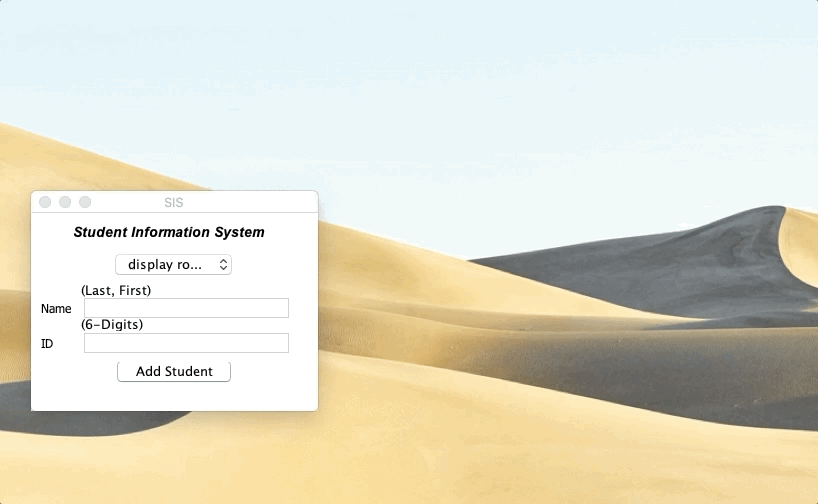

# Student Information System 
Java application organizes students by name and ID number. Input student name and ID number to save into a respective text file. Sort, find, delete students. The app's graphic user interface was made with JFrame.

## Download
**Download Prerequisites** 
Make sure you already have Java installed.

**Download Instructions** 
1. Either fork the repository OR download the files as a .zip
2. Put **student_info_system.jar** in the directory of your choice
3. Open .jar file and done!

## Application
**On Launch** 
 

**Show Roster of Students** 
 

**Find Student** 

**Delete Student** 
 

